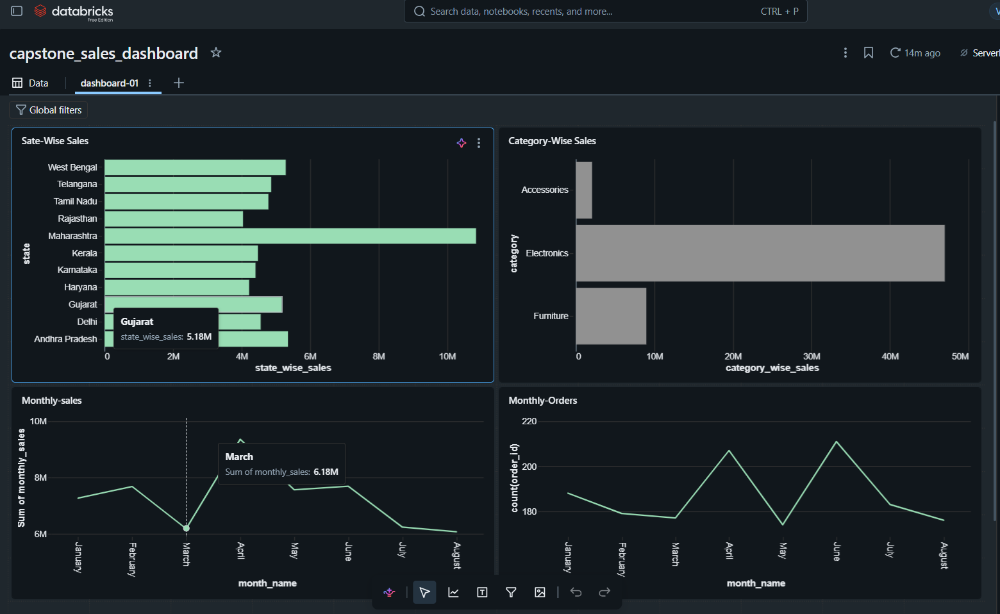

# Databricks Capstone Project : 4-Sept-2026

## Overview

This project implements an end-to-end Sales Data  solution on Databricks using the Medallion Architecture (Bronze, Silver, and Gold layers).

The pipeline ingests raw sales data from a Unity Catalog Volume, performs data quality validation and cleansing, transforms the data into analytics-ready datasets, and generates business insights using aggregated Gold layer tables.

Deployment and workflow orchestration are automated using Databricks Asset Bundles (DAB) and GitHub Actions CI/CD.

---

## Architecture

```text
Sales CSV Files
      |
      v
+-------------------+
| Bronze Layer      |
| Raw Ingestion     |
+-------------------+
      |
      v
+-------------------+
| Data Quality      |
| Validation Rules  |
+-------------------+
      |
      v
+-------------------+
| Silver Layer      |
| Cleaned Data      |
+-------------------+
      |
      v
+-------------------+
| Gold Layer        |
| Business Metrics  |
+-------------------+
      |
      v
+-------------------+
| SQL Dashboard     |
+-------------------+
```

---

## Dataset

### Sales Data Columns

| Column | Description |
|----------|-------------|
| order_id | Unique order identifier |
| order_date | Order date |
| customer_id | Customer identifier |
| customer_name | Customer name |
| city | Customer city |
| state | Customer state |
| product_id | Product identifier |
| product_name | Product name |
| category | Product category |
| quantity | Quantity purchased |
| unit_price | Unit price |
| discount_pct | Discount percentage |
| gross_amount | Gross sales amount |
| discount_amount | Discount amount |
| net_amount | Final sales amount |
| payment_method | Payment method |
| order_status | Completed, Cancelled, or Returned |

---

## Project Structure

```text
databricks_sales_capstone/
│
├── databricks.yml
│
├── resources/
│   └── sales_job.yml
│
├── src/
│   ├── 00_data_quality_report.py
│   ├── 01_bronze_ingestion.py
│   ├── 02_silver_cleaning.py
│   └── 03_gold_analytics.py
│
├── .github/
│   └── workflows/
│       └── deploy.yml
│
├── data/
│   └── sales_source_1500.csv
│
└── README.md
```

---

# Medallion Architecture Implementation

## Stage 1: Source Data

The source sales dataset is uploaded to a Unity Catalog Volume.

### Source Location

```text
/Volumes/workspace/ibm/databricks_capstone/input
```

### File Format

```text
CSV
```

---

## Stage 2: Bronze Layer

The Bronze layer stores raw sales data ingested using Databricks Auto Loader.

### Bronze Table

```sql
workspace.ibm.capstone_bronze_sales
```

### Processing

- Incremental ingestion using Auto Loader
- Schema inference and evolution
- Raw data preservation
- Stream-based ingestion

---

## Stage 3: Data Quality Validation

A framework is implemented to identify and flag invalid data records.

### Validation Rules

| Rule | Quality Flag |
|--------|-------------|
| customer_id IS NULL | INVALID_CUSTOMER |
| quantity <= 0 | INVALID_QUANTITY |
| net_amount < 0 | INVALID_AMOUNT |
| product_id = 'UNKNOWN' | INVALID_PRODUCT |
| Valid Record | VALID |

### Data Quality Outcomes

Records are categorized into:

- Valid Records
- Invalid Records

Valid records proceed to the Silver layer.

Invalid records are redirected to a Quarantine table for auditing and remediation.

---

## Quarantine Layer

The Quarantine layer stores all records that fail one or more business validation rules.

### Table

```sql
workspace.ibm.capstone_quarantine_sales
```

### Purpose

- Store rejected records
- Enable data quality analysis
- Support root cause investigation
- Prevent bad data from reaching downstream layers

### Quality Flags

```text
INVALID_CUSTOMER
INVALID_QUANTITY
INVALID_AMOUNT
INVALID_PRODUCT
```

Only records marked as `VALID` are promoted to the Silver layer.

---

## Stage 4: Silver Layer

The Silver layer contains cleansed and standardized business data.

### Silver Table

```sql
workspace.ibm.capstone_silver_sales
```

### Transformations Performed

- Data type conversion
- String trimming
- Null handling
- Data validation
- Removal of invalid records
- Business rule enforcement
- Date enrichment

### Additional Derived Columns

| Column | Description |
|----------|-------------|
| year | Sales year |
| month | Sales month number |
| month_name | Sales month name |

---

## Stage 5: Gold Layer

The Gold layer contains aggregated business metrics for reporting and analytics.

### Gold Table

```sql
workspace.ibm.capstone_gold_sales_summary
```

### Business Metrics

- Total Orders
- Units Sold
- Gross Sales
- Discount Amount
- Net Sales
- Average Order Value

---

## Stage 6: Workflow Orchestration

A Databricks Workflow orchestrates the entire pipeline.

### Job Name

```text
sales_job
```

### Workflow Execution

```text
01 Bronze Ingestion
          ↓
00 Data Quality Report
          ↓
02 Silver Cleaning
          ↓
03 Gold Analytics
```

---

## Stage 7: CI/CD Deployment

Continuous Integration and Continuous Deployment are implemented using GitHub Actions and Databricks Asset Bundles.

### Deployment Flow

```text
Developer Commit
        ↓
GitHub Repository
        ↓
GitHub Actions
        ↓
Databricks Bundle Validate
        ↓
Databricks Bundle Deploy
        ↓
Databricks Workflow Execution
```

### CI/CD Files

```text
databricks.yml
resources/sales_job.yml
.github/workflows/deploy.yml
```

### Benefits

- Automated deployment
- Version control
- Repeatable releases
- Infrastructure as Code

---

## Stage 8: Dashboarding

A Databricks SQL Dashboard is built using Gold Layer data.

🔗 **Dashboard Link:**
https://dbc-0ba1db16-aea9.cloud.databricks.com/dashboardsv3/01f1a84442461aa486114a1c5151f566/published?o=7474645223804363

### Dashboard Visualizations

### 1. Monthly Sales Trend

```text
Month → Net Sales
```

### 2. Sales by State

```text
State → Net Sales
```

### 3. Sales by Category

```text
Category → Net Sales
```

### 4. Orders by Month

```text
Month → Total Orders
```
### Dashboard Preview


---

## Technologies Used

- Databricks
- Unity Catalog
- Delta Lake
- PySpark
- Databricks Auto Loader
- Databricks Workflows
- Databricks Asset Bundles (DAB)
- GitHub Actions
- Databricks SQL

---

## Key Features

✅ Medallion Architecture (Bronze → Silver → Gold)

✅ Streaming Data Ingestion using Auto Loader

✅ Data Quality Validation Framework

✅ Delta Lake Storage

✅ Unity Catalog Governance

✅ Workflow Orchestration

✅ GitHub CI/CD Integration

✅ Business Analytics Dashboard

✅ End-to-End Lakehouse Implementation

---

## Author

**Rupam Das**

Project: Databricks Capstone

Platform: Databricks Lakehouse